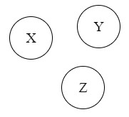
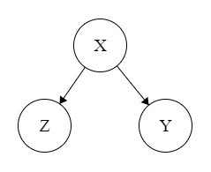
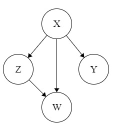
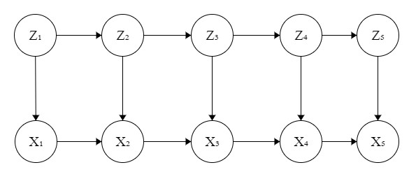

# Week 10 - Theoretical Exerises

## Exercise 1

Join probabilities for random variables

### Graph 1

$$
p(X)p(Y)p(Z|X,Y)
$$

### Graph 2

$$
p(X)p(Y|X)p(Z|X,Y)
$$

### Graph 3

$$
p(X)p(Y|X)p(Z|X)p(W|Y,Z)
$$

### Graph 

$$
p(Z_1)
\left( \prod_{i=2}^5 p(Z_i|Z{i-1}) \right)
\left( \prod_{i=1}^5 p(X_i|Z{i}) \right)
$$

## Exercise 2

### Probability 1
$$
p(X)p(Y)p(Z)
$$

### Probability 2
$$
p(X)p(Y|X)p(Z|X)
$$

### Probability 3
$$
p(X)p(Y|X)p(Z|Y)p(W|X,Z)
$$

### Probability 4
$$
p(Z_1)p(X_1|Z_1)
\left(\prod_{i=2}^5p(X_i|Z_i,X_{i-1})\right)
\left(\prod_{i=2}^5p(Z_i|Z_{i-1})\right)
$$

